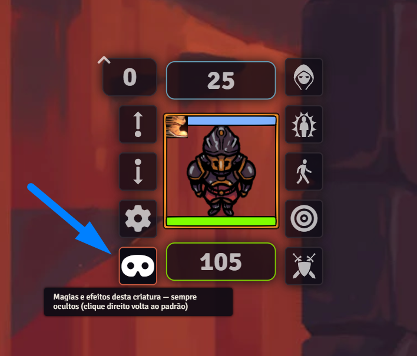

# T20 Hayd GMTools

Ferramentas de Mestre para o sistema **Tormenta20**: O módulo tem como objetivo entregar diversas ferramentas e automações para auxiliar na hora de jogo, algumas de suas funções incluem: ocultar dos jogadores os detalhes das rolagens e habilidades das criaturas do Mestre, permite rerolar ou inserir resultados manualmente pelo chat, gera e distribui tesouros pelas tabelas dos livros, reúne o grupo numa ficha compartilhada com estoque e dinheiro em comum, oferece uma régua opcional para efeitos que ignora diagonais e adiciona um assistente completo de definição de atributos iniciais dos personagens.

## Requisitos

- FoundryVTT **v13**
- Sistema **Tormenta20**

## Instalação

Em *Configurar → Módulos Complementares → Instalar Módulo*, cole a URL do manifesto:

```
https://github.com/ahahayd/t20-hayd-gmtools/releases/latest/download/module.json
```

## Como usar

### Ocultar detalhes das criaturas do Mestre

Funciona automaticamente após ativar o módulo. Rolagens de NPCs e Perigos mostram o total, mas mascaram a fórmula (`1d20+?`, dano `?`), o breakdown e o destaque de crítico; cards de magias e poderes escondem descrição, aprimoramentos e CD. Donos e observadores da criatura continuam vendo tudo, e personagens jogadores nunca são afetados.


*A mesma rolagem de arma nas duas telas: o total é o mesmo, o bônus não aparece.*

O que fica oculto é escolhido no **Nível de metagame** (veja abaixo) — dá para esconder tudo, só parte, ou desabilitar a função por completo.

### Nível de metagame

Em *Configurar → Configurações → T20 Hayd GMTools → Nível de metagame*, o Mestre marca item a item o que os jogadores **não** podem ver nas criaturas dele:

| Opção | O que esconde |
| --- | --- |
| Soma do ataque | A fórmula vira `1d20+?` em vez do bônus real (o total continua visível) |
| Rolagem de dano | A fórmula do dano vira `?` (o total continua visível) |
| CD de magias e habilidades | `CD 15` vira `CD ?` no cartão do chat |
| Descrição de magias e poderes | O texto e os aprimoramentos do cartão |
| Nome de magias e poderes | Nome, ícone, escola e nível — o cartão vira "Magia não identificada" |
| Efeitos ativos nas criaturas | Ícone e nome dos buffs sobre o token viram "?" |
| Destaque de crítico e falha | O verde do crítico e o vermelho da falha no total |
| Animação dos dados | Os dados 3D do Dice So Nice na tela dos jogadores |


*Várias chaves agindo no mesmo cartão: nome, escola, CD e fórmula de dano ocultos, o total do dano e a área continuam visíveis, porque o jogador precisa deles para jogar.*

Independentemente da configuração, o Mestre pode revelar ou reocultar uma mensagem específica pelo menu de contexto do chat.

> Em mundos que já usavam o módulo antes, as duas chaves novas (*Nome de magias e poderes* e *Efeitos ativos nas criaturas*) entram **desligadas**, para não mudar a mesa sem o Mestre pedir. Mundos novos já vêm com tudo oculto.

Com o **Dice So Nice**, o dado 3D do mestre não rola na tela do jogador, evitando que o jogador veja o resultado na animação 3D.

### Magias, poderes e efeitos não identificados

Com essas chaves ligadas, o que a criatura do Mestre faz chega ao jogador anônimo:


*Execução, alcance, alvo e duração continuam à vista, o jogador sabe que algo foi conjurado e como reagir, sem saber o quê.*

- **No chat** o cartão da conjuração vira *Magia não identificada* (ou *Poder não identificado*), com ícone de "?", sem escola nem nível, e os botões de aplicar efeito também ficam mascarados.
- **No token** os ícones dos efeitos viram "?" e o texto flutuante que o Foundry mostra ao aplicar um efeito passa de `+(Velocidade)` para `+(Efeito desconhecido)`. Condições do sistema (caído, cego, abalado…) **não** são mascaradas.

Três controles ajustam isso:

1. **Revelar magia/poder** — botão direito na mensagem do chat. Devolve nome, ícone e rótulos daquela conjuração; *Ocultar magia/poder* desfaz. (A entrada *Mostrar fórmula para os jogadores*, que já existia, revela a mensagem inteira.)
2. **Padrão da criatura** — o botão de máscara no HUD do token (clique com o direito no token). Clique esquerdo força *sempre oculto* ou *sempre visível* para aquela criatura; clique direito volta a seguir o nível de metagame. Em tokens **não vinculados** a marcação vale só para aquele token (cada goblin da cena tem a sua); em tokens vinculados, vale para o ator inteiro.
3. **Efeito identificado** — campo na aba *Detalhes* da ficha do efeito ativo, com três valores: *Padrão da criatura*, *Sim* (nome e ícone normais) e *Não* (vira "?"). Serve tanto para revelar um efeito específico quanto para esconder um que seria público.



*O botão de máscara no HUD define o padrão daquela criatura, sem precisar abrir as configurações.*


*O campo **Efeito identificado** fica no fim da aba Detalhes do efeito ativo, e vale só para aquele efeito.*

### Rerolar e inserir resultados

Clique com o botão direito em uma mensagem de rolagem no chat para **rerolar** (mantendo todos os bônus, sem cobrar mana de novo) ou **inserir manualmente** o resultado do dado — útil para poderes que permitem escolher a rolagem. Em cards de arma, ataque e dano são tratados separadamente, e se o ataque virar (ou deixar de ser) um crítico, o dano é recalculado sozinho. Rolagens alteradas ganham um símbolo com o resultado anterior riscado.


*Ataque e dano aparecem como entradas separadas, então dá para refazer um sem mexer no outro.*

### Gerador de tesouros

O botão do saco de moedas na barra de ferramentas de tokens (só para o Mestre) abre o **Gerador de Tesouros**, que segue as tabelas de tesouro dos livros: você escolhe o nível de desafio e o tipo de cada coluna — **Normal** (rola uma vez), **Dobro** (rola duas e acumula), **Metade** (a tesoura ao lado do valor corta o dinheiro pela metade) ou **Nenhum** —, e o gerador rola o dado de cada tabela até chegar no item final.


*O gerador fica na barra de tokens, ao lado da régua de efeitos.*

Cada resultado guarda a **trilha de rolagens** que levou até ele — passe o mouse por cima para ver qual d100 caiu em qual faixa, em qual tabela, até o item. O dinheiro é somado nas denominações do sistema (TL, TO, TP e TC), sem conversão automática.

A metade de baixo da janela é a **distribuição**: arraste atores (ou uma pasta inteira) para montar a lista de quem vai receber, arraste cada item para um personagem e reparta o dinheiro. A divisão **não converte moedas** — o que não dá para dividir por igual fica marcado como sobra *em disputa*, para a mesa resolver. No fim, um resumo diagramado vai para o chat.

Três janelas de configuração ajustam as tabelas, em *Configurar → Configurações → T20 Hayd GMTools → Gerador de tesouros*:

- **Escolher livros** — desligue os livros que a sua mesa não usa (*Tormenta20*, *Heróis de Arton*, *Deuses de Arton*, *Ameaças de Arton*) e as entradas deles saem das rolagens. O espaço das entradas desligadas é **redividido entre as que ficam**, proporcionalmente à raridade original: o dado continua o mesmo e nada é rerrolado, então a hora de rolar o tesouro não trava nem repete.
- **Gerenciar homebrew** — adiciona resultados personalizados a qualquer tabela, estendendo o dado (d100 → d101…) quando precisa, e permite renomear ou tirar do sorteio qualquer entrada oficial. A lista das entradas do livro mostra as faixas **como elas realmente vão rolar** com os livros que você tem ligados, e marca quem está fora e por quê.
- **Gerenciar vínculos** — mostra quais resultados das tabelas apontam para um item do mundo, quais estão ambíguos e quais não têm vínculo nenhum. Dá para corrigir arrastando um item para a linha, clicar no nome para abrir o item, e refazer tudo do zero em *Resetar vínculos*.

As tabelas de tesouro do gerador foram construídas a partir da [planilha criada e fornecida gratuitamente por Guilherme Dei Svaldi](https://docs.google.com/spreadsheets/d/18n22comQYq8L1QSucDbIecWnNsrjJb-paQUoU0FkX5Y/edit?gid=22296790#gid=22296790).

### Ficha do Grupo

Uma ficha compartilhada por todos os personagens de uma pasta de atores, com um **estoque e um dinheiro em comum**. A tecla **B** abre a ficha do grupo a que você pertence (com mais de um, ela pergunta qual, já vindo marcado o último que você abriu); o Mestre também tem um botão no diretório de Atores.


*O botão de grupo fica ao lado do nome da pasta no diretório de Atores — clique nele para abrir a ficha.*

- **Membros** — vida, mana, defesa, deslocamento, resistências, percepção e iniciativa de todo mundo numa tela só. Quanto os jogadores enxergam de vida e mana dos colegas (valores exatos, porcentagem ou oculto) é configurável; o Mestre sempre vê os números.
- **Inventário do grupo** — o estoque comum. Os jogadores podem **pegar** e **depositar** itens e dinheiro por conta própria, e apagar itens do estoque; transferências entre personagens podem exigir confirmação de quem recebe.
- **Ferramentas do Mestre** — descanso do grupo (com qualidade da hospedagem e PV/PM extras), pedido de rolagem de perícia para os personagens escolhidos (pública, para o Mestre, às cegas ou secreta) e distribuição do dinheiro do estoque.

Os grupos são definidos em *Gerenciar grupos*, apontando uma pasta de atores para cada um.

### Automações de itens

O botão **Automação** nas fichas de item liga contadores e efeitos automáticos para habilidades que precisam de controle a cada rodada ou a cada uso (Sangue dos Inimigos, Combinações Desarmadas e afins). Desligar a configuração não apaga nada — religar volta tudo a funcionar.


*O botão fica ao lado do "Sheet" no cabeçalho da ficha de item.*

Um **Diário de Automações** detalha o funcionamento de cada uma, incluindo quais efeitos são criados, como os contadores funcionam e o que acontece a cada uso. O diário é criado automaticamente na primeira vez que o módulo é ativado, e pode ser aberto a qualquer momento em *Configurar → Configurações → T20 Hayd GMTools → Automações de itens → Abrir diário de automações*.

### Régua para efeitos (ignora diagonais)

No T20, **só o movimento** conta a diagonal como 3 m. Para os demais efeitos — alcance de ataques (corpo a corpo e à distância), de magias, de habilidades e de poderes — a diagonal é **ignorada** e vale 1,5 m, como qualquer outro quadrado. A Jambô já esclareceu isso em respostas oficiais, inclusive quanto a atacar na diagonal (por mais estranho que seja).

Para quem quiser medir desse jeito sem ficar contando na mão, o módulo disponibiliza uma régua opcional que ignora diagonais: cada quadrado na diagonal conta como um quadrado (1,5 m), e não como dois (3 m).

> **Não vale para áreas de efeito.** Explosões, cones, linhas e afins continuam usando os gabaritos (*templates*) do próprio sistema, que já aplicam as regras corretas de área.

Ela é **desligada por padrão** e precisa ser habilitada pelo Mestre em *Configurar → Configurações → T20 Hayd GMTools → Régua para efeitos*. Uma vez ligada, aparece um segundo ícone de régua na barra de ferramentas de tokens, ao lado da régua padrão.


A régua padrão do Foundry **continua existindo e funcionando exatamente como antes**. A régua de efeitos se comporta como a padrão em tudo (arrastar para medir, `Ctrl` + clique para pontos de parada, botão direito para desfazer o último ponto, `Alt` para medir sem que os outros vejam, roda do mouse com `Ctrl` para elevação); só o cálculo da distância muda.

A ferramenta só aparece em cenas com grade quadrada — em grade hexagonal ou sem grade não existe diagonal a descontar, e ela seria idêntica à régua padrão.

### Definição de atributos

Um botão nas configurações do personagem abre o assistente de atributos iniciais, com todos os métodos: **compra por pontos** (com pontos variados), **rolagens do Livro Básico** e as variantes do **Heróis de Arton** (Clássica, Épica, Valkaria e Nimb) além do arranjo de Khalmyr. O assistente escreve apenas os valores base; o bônus racial continua por sua conta.


*Cada método traz a página do livro e um resumo da regra; o padrão escolhido pelo Mestre vem destacado.*

### Configurações

Em *Configurar → Configurações → T20 Hayd GMTools*, as opções ficam agrupadas por assunto:

| Grupo | O que tem |
| --- | --- |
| Ocultação e metagame | O menu do **nível de metagame** |
| Rolagens no chat | Se os jogadores podem rerolar e inserir resultados nas próprias rolagens |
| Automações de itens | Liga o botão *Automação* nas fichas de item |
| Gerador de tesouros | Vínculos, livros e homebrew das tabelas |
| Ficha do Grupo | Liga a ficha, visibilidade de vida/mana, confirmação de transferências e avisos no chat |
| Atributos iniciais | Método padrão da campanha, pontos sugeridos e as tabelas de custo/conversão personalizadas |
| Ferramentas de mesa | A **régua para efeitos** |

## Aviso

Módulo não oficial, criado por fã, sem afiliação com a Jambô Editora ou com os autores de Tormenta20.
