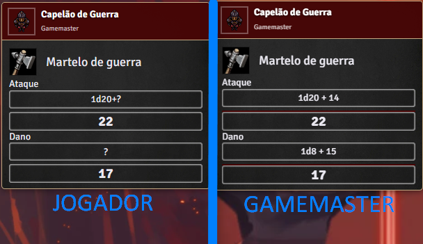
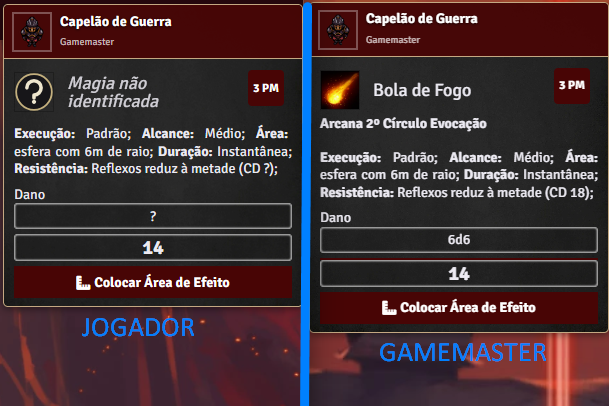
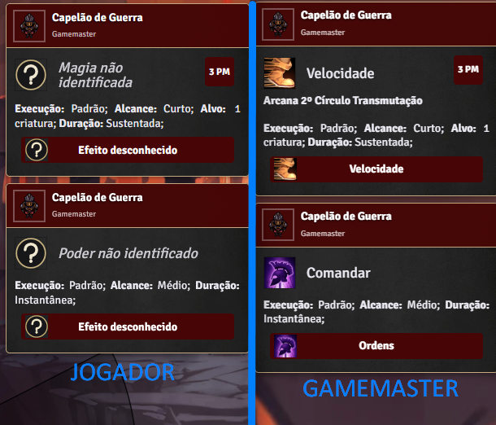

# T20 Hayd GMTools

Ferramentas de Mestre para o sistema **Tormenta20** no FoundryVTT: oculta dos jogadores os detalhes das rolagens e habilidades das criaturas do Mestre, permite rerolar ou inserir resultados manualmente pelo chat, oferece uma régua opcional para efeitos que ignora diagonais, adiciona um assistente completo de definição de atributos iniciais dos personagens, e reúne a Ficha do Grupo (ex-T20 Hayd Gestão de Party): estoque compartilhado, transferência de dinheiro/itens entre personagens e distribuição de tesouros gerados.

## Requisitos

- FoundryVTT **v13**
- Sistema **Tormenta20**
- **socketlib** *(obrigatório — instalado automaticamente como dependência; usado pelas transferências entre personagens)*
- *(Opcional)* **Dice So Nice** — para ocultar também a animação 3D dos dados das criaturas do Mestre

## Instalação

Em *Configurar → Módulos Complementares → Instalar Módulo*, cole a URL do manifesto:

```
https://github.com/ahahayd/t20-hayd-gmtools/releases/latest/download/module.json
```

## Como usar

### Ocultar detalhes das criaturas do Mestre

Funciona automaticamente após ativar o módulo. Rolagens de NPCs, Perigos e Coadjuvantes mostram o total, mas mascaram a fórmula (`1d20+?`, dano `?`), o breakdown e o destaque de crítico; cards de magias e poderes escondem descrição, aprimoramentos e CD. Donos e observadores da criatura continuam vendo tudo, e personagens jogadores nunca são afetados.



*A mesma rolagem de arma nas duas telas: o total é o mesmo, o bônus não aparece.*

O que fica oculto é escolhido no **Nível de metagame** (veja abaixo) — dá para esconder tudo, só parte, ou nada.

### Nível de metagame

Em *Configurar → Configurações → T20 Hayd GMTools → Nível de metagame*, o Mestre marca item a item o que os jogadores **não** podem ver nas criaturas dele:

| Opção | O que esconde |
| --- | --- |
| Soma do ataque | A fórmula vira `1d20+?` em vez do bônus real (o total continua visível) |
| Rolagem de dano | A fórmula do dano vira `?` (o total continua visível) |
| CD de magias e habilidades | `CD 15` vira `CD ?` no cartão do chat |
| Descrição de magias e poderes | O texto e os aprimoramentos do cartão |
| Nome de magias e poderes | Nome, ícone, escola e nível — o cartão vira "Magia não identificada" |
| Efeitos ativos nas criaturas | Ícone e nome dos buffs sobre o token viram "?" |
| Destaque de crítico e falha | O verde do crítico e o vermelho da falha no total |
| Animação dos dados | Os dados 3D do Dice So Nice na tela dos jogadores |



*Várias chaves agindo no mesmo cartão: nome, escola, CD e fórmula de dano ocultos — o total do dano e a área continuam visíveis, porque o jogador precisa deles para jogar.*

Uma **chave-mestra** no topo desliga tudo de uma vez (mesa sem ocultação), e três atalhos preenchem os níveis prontos: *Esconder tudo*, *Só as rolagens* e *Não esconder nada*. A mudança vale na hora, inclusive nas mensagens já no chat. Independentemente da configuração, o Mestre pode revelar ou reocultar uma mensagem específica pelo menu de contexto do chat.

> Em mundos que já usavam o módulo antes da v1.7.0, as duas chaves novas (*Nome de magias e poderes* e *Efeitos ativos nas criaturas*) entram **desligadas**, para não mudar a mesa sem o Mestre pedir. Mundos novos já vêm com tudo oculto.

Com o **Dice So Nice**, o dado 3D não rola na tela do jogador — mas o resultado no chat também não aparece antes da hora: o cliente de quem rolou avisa quando o dado parou, e só então o total é liberado para todo mundo ao mesmo tempo. Se o aviso não chegar, o resultado aparece sozinho depois de 5 segundos.

### Magias, poderes e efeitos não identificados

Com essas chaves ligadas, o que a criatura do Mestre faz chega ao jogador anônimo:



*Execução, alcance, alvo e duração continuam à vista — o jogador sabe que algo foi conjurado e como reagir, sem saber o quê.*


- **No chat** — o cartão da conjuração vira *Magia não identificada* (ou *Poder não identificado*), com ícone de "?", sem escola nem nível, e os botões de aplicar efeito também ficam mascarados.
- **No token** — os ícones dos efeitos viram "?" e o texto flutuante que o Foundry mostra ao aplicar um efeito passa de `+(Velocidade)` para `+(Efeito desconhecido)`. Condições do sistema (caído, cego, abalado…) **não** são mascaradas: são informação pública na mesa.

Três controles ajustam isso:

1. **Revelar magia/poder** — botão direito na mensagem do chat. Devolve nome, ícone e rótulos daquela conjuração; *Ocultar magia/poder* desfaz. (A entrada *Mostrar fórmula para os jogadores*, que já existia, revela a mensagem inteira.)
2. **Padrão da criatura** — o botão de máscara no HUD do token (clique com o direito no token). Clique esquerdo força *sempre oculto* ou *sempre visível* para aquela criatura; clique direito volta a seguir o nível de metagame. Em tokens **não vinculados** a marcação vale só para aquele token (cada goblin da cena tem a sua); em tokens vinculados, vale para o ator inteiro.
3. **Efeito identificado** — campo na aba *Detalhes* da ficha do efeito ativo, com três valores: *Padrão da criatura*, *Sim* (nome e ícone normais) e *Não* (vira "?"). Serve tanto para revelar um efeito específico quanto para esconder um que seria público.

### Rerolar e inserir resultados

Clique com o botão direito em uma mensagem de rolagem no chat para **rerolar** (mantendo todos os bônus, sem cobrar mana de novo) ou **inserir manualmente** o resultado do dado — útil para poderes que permitem escolher a rolagem. Em cards de arma, ataque e dano são tratados separadamente, e se o ataque virar (ou deixar de ser) um crítico, o dano é recalculado sozinho. Rolagens alteradas ganham um símbolo (⟳ ou ✋) com o resultado anterior riscado.

### Régua para efeitos (ignora diagonais)

No T20, **só o movimento** conta a diagonal como 3 m. Para os demais efeitos — alcance de ataques (corpo a corpo e à distância), de magias, de habilidades e de poderes — a diagonal é **ignorada** e vale 1,5 m, como qualquer outro quadrado. A Jambô já esclareceu isso em respostas oficiais e no FAQ, inclusive quanto a atacar na diagonal.

Para quem quiser medir desse jeito sem ficar contando na mão, o módulo disponibiliza uma régua opcional que ignora diagonais: cada quadrado na diagonal conta como um quadrado (1,5 m), e não como dois (3 m).

> **Não vale para áreas de efeito.** Explosões, cones, linhas e afins continuam usando os gabaritos (*templates*) do próprio sistema, que já aplicam as regras corretas de área.

Ela é **desligada por padrão** e precisa ser habilitada pelo Mestre em *Configurar → Configurações → T20 Hayd GMTools → Régua para efeitos*. Uma vez ligada, aparece um segundo ícone de régua na barra de ferramentas de tokens, ao lado da régua padrão.

A régua padrão do Foundry **continua existindo e funcionando exatamente como antes** — e é ela que você usa para medir movimento. As duas convivem, e você escolhe qual usar clicando na ferramenta correspondente. A régua de efeitos se comporta como a padrão em tudo (arrastar para medir, `Ctrl` + clique para pontos de parada, botão direito para desfazer o último ponto, `Alt` para medir sem que os outros vejam, roda do mouse com `Ctrl` para elevação); só o cálculo da distância muda. O rótulo dela vem com contorno e ícone avermelhados, para não confundir com o da régua padrão, e os outros jogadores conectados veem o mesmo número que você.

A ferramenta só aparece em cenas com grade quadrada — em grade hexagonal ou sem grade não existe diagonal a descontar, e ela seria idêntica à régua padrão. O movimento de tokens e a régua de arrastar do sistema não são afetados de forma alguma.

### Definição de atributos

Um botão nas configurações do personagem abre o assistente de atributos iniciais, com todos os métodos: **compra por pontos** (com pontos variados), **rolagens do Livro Básico** e as variantes do **Heróis de Arton** (Clássica e Épica, p. 280; Valkaria e Nimb, p. 281 — com rolagem individual de cada dado) e o **arranjo de Khalmyr**. O assistente escreve apenas os valores base; o bônus racial continua por sua conta.

### Ficha do Grupo

Crie uma pasta na barra lateral de *Atores* com os personagens do grupo e registre-a em *Configurar → Configurações → T20 Hayd GMTools → Gerenciar Parties*. A Ficha do Grupo reúne retrato, PV/PM/carga, Defesa, Deslocamento, testes de Fortitude/Reflexos/Vontade/Percepção/Iniciativa e sentidos especiais de cada personagem, um **estoque compartilhado** (arraste itens da ficha para o estoque e de volta, ou de um compêndio direto para o estoque) e, numa aba exclusiva do Mestre, ferramentas de distribuir dinheiro, aplicar descanso em grupo, pedir testes de perícia e **gerar tesouros direto para o estoque** (veja "Gerador de tesouros" abaixo).

A **transferência de dinheiro e itens entre personagens** — o botão de enviar dinheiro na ficha, o "Enviar para..." no menu de contexto dos itens, e arrastar itens entre fichas ou para um token no mapa — é nativa do GMTools e funciona **mesmo com a Ficha do Grupo desligada**; só a janela e o botão que a abrem dependem do interruptor.

A Ficha do Grupo pode ser desligada em *Configurar → Configurações → T20 Hayd GMTools → Ativar Ficha do Grupo*. Sem nenhuma party configurada, ela já se comporta como se não existisse — não é preciso desligar nada num mundo novo.

### Configurações

Em *Configurar → Configurações → T20 Hayd GMTools*, o Mestre define o **nível de metagame**, se jogadores podem rerolar/inserir resultados nas próprias rolagens, se a **régua para efeitos** existe na mesa, se as **automações de itens** e a **Ficha do Grupo** estão ativas, o método de atributos padrão da campanha (destacado no assistente), os pontos sugeridos e as tabelas de custo/conversão personalizadas.

## Detalhes adicionais

- Personagens recém-criados exibem o ícone de definição de atributos com um brilho pulsante até a primeira definição.
- O Mestre sempre pode rerolar e inserir resultados, independentemente das permissões dos jogadores.

## Aviso

Módulo não oficial, criado por fã, sem afiliação com a Jambô Editora ou com os autores de Tormenta20.
